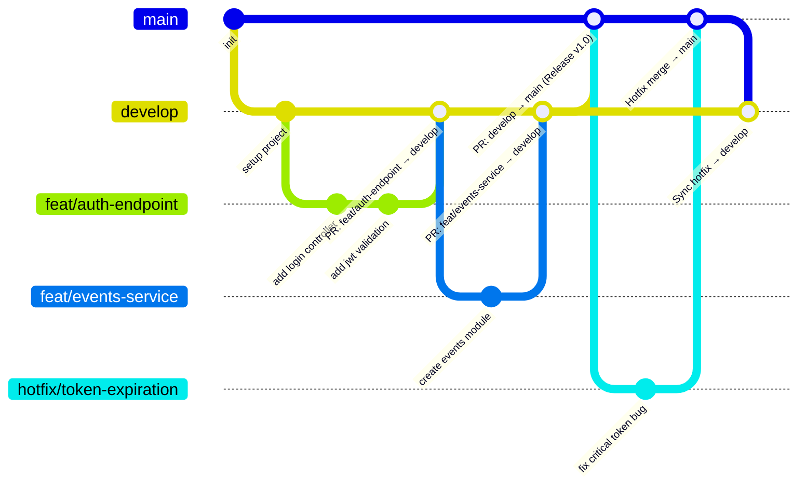

# 🎫 NextTicket — Guía de Flujo de Trabajo y Git Flow

Este documento define la **arquitectura de ramas**, las **convenciones de commits** y el **proceso de desarrollo** del equipo. Todo colaborador debe seguir estas directrices para mantener el repositorio limpio y estable.

---

## 📋 Tabla de Contenidos

1. [Arquitectura de Ramas — Git Flow](#1-arquitectura-de-ramas--git-flow)
2. [Flujo de Trabajo Paso a Paso](#2-flujo-de-trabajo-paso-a-paso)
3. [Convenciones de Commits](#3-convenciones-de-commits)
4. [Proceso de Pull Requests (PR)](#4-proceso-de-pull-requests-pr)

---

## 1. Arquitectura de Ramas — Git Flow

Seguimos un flujo de trabajo **Git Flow** profesional para garantizar orden en el desarrollo y estabilidad en producción.

### Diagrama del Flujo de Ramas



---

### 1.1. Ramas Principales (Permanentes)

Estas ramas **nunca se eliminan** y son la columna vertebral del proyecto.

#### 🟢 `main` — Producción
- **Estado:** ✅ Siempre estable y lista para producción.
- **Protección:** 🔒 Rama protegida — **NO se permite push directo**.
- **Integración:** Solo recibe cambios desde `develop` vía Pull Request revisado y aprobado.

#### 🔵 `develop` — Integración / Desarrollo
- **Estado:** 🔄 Integración continua con las últimas funcionalidades.
- **Integración:** Recibe cambios de las ramas temporales (`feat/*`, `fix/*`, `refactor/*`, `docs/*`) vía PR.
- **Base:** ✅ **Todas las nuevas ramas de trabajo se crean a partir de `develop`**.

---

### 1.2. Ramas de Trabajo (Temporales)

Se crean para tareas específicas desde `develop` y **se eliminan tras ser fusionadas (mergeadas)**.

| Prefijo | Propósito | Origen | Destino | Ejemplo |
|---------|-----------|--------|---------|---------|
| `feat/*` | Nuevas funcionalidades | `develop` | `develop` | `feat/login-module` |
| `fix/*` | Corrección de bugs en desarrollo | `develop` | `develop` | `fix/jwt-validation-error` |
| `hotfix/*` | Errores críticos en producción | `main` | `main` y `develop` | `hotfix/cors-crash` |
| `refactor/*` | Mejoras de código sin alterar lógica | `develop` | `develop` | `refactor/clean-services` |
| `docs/*` | Documentación | `develop` | `develop` | `docs/api-endpoints` |

> **Nota:** Los nombres de las ramas deben escribirse siempre en **kebab-case** (minúsculas y separadas por guiones).

---

## 2. Flujo de Trabajo Paso a Paso

Sigue estos 6 pasos exactos en cada tarea:

### Paso 1: Sincronizar tu rama `develop` local
```bash
git checkout develop
git pull origin develop
```

### Paso 2: Crear tu rama de trabajo temporal
```bash
# Ejemplo para una nueva funcionalidad:
git checkout -b feat/nombre-de-la-tarea

# Ejemplo para corregir un bug:
git checkout -b fix/nombre-del-bug
```

### Paso 3: Desarrollar tu tarea
Realiza tus cambios y verifica localmente que tu código funcione correctamente.

### Paso 4: Guardar cambios con commits estandarizados
```bash
git add .
git commit -m "[FEAT]: description of the feature in english"
```

### Paso 5: Subir tu rama al repositorio remoto
```bash
# Primera vez (vincula la rama remota):
git push -u origin feat/nombre-de-la-tarea

# Siguientes subidas en la misma rama:
git push
```

### Paso 6: Abrir Pull Request (PR) en GitHub
Abre un PR apuntando hacia `develop` y solicita revisión.

---

## 3. Convenciones de Commits

Cada mensaje de commit debe seguir la convención estructurada:

```
[TIPO]: descripción clara y breve
```

### Tipos Permitidos

| Tipo | Cuándo usarlo | Ejemplo de Commit |
|------|---------------|-------------------|
| `[FEAT]` | Nueva funcionalidad o módulo | `[FEAT]: add auth jwt strategy` |
| `[FIX]` | Corrección de un bug o error | `[FIX]: resolve null exception on user find` |
| `[DOCS]` | Cambios en documentación o README | `[DOCS]: update branching workflow guidelines` |
| `[REFACTOR]` | Optimización de código sin cambiar lógica | `[REFACTOR]: extract validation logic to helper` |
| `[STYLE]` | Formato, espacios, punto y coma (no CSS) | `[STYLE]: fix code formatting and indentation` |
| `[TEST]` | Agregar o actualizar pruebas unitarias/e2e | `[TEST]: add unit tests for user controller` |
| `[CHORE]` | Configuración, librerías, dependencias | `[CHORE]: update dependencies to latest version` |
| `[PERF]` | Mejoras de rendimiento | `[PERF]: optimize database query logic` |

### ⚠️ Reglas para los Commits
1. ✅ **Usar verbos en imperativo e inglés:** `add`, `fix`, `update`, `remove` (no `added`, `fixing`, `agregué`).
2. ✅ **Brevedad:** Máximo 72 caracteres en la línea principal.
3. ✅ **Atómico:** Un cambio lógico por commit.
4. ❌ **Evitar:** Mensajes genéricos como `"fix"`, `"update"`, `"cambios"`, `"wip"`.

---

## 4. Proceso de Pull Requests (PR)

> ⛔ **NUNCA hagas merge directo de tu rama de trabajo en `develop` ni `main` localmente.** Todo cambio se integra a través de GitHub.

### Flujo Estándar (`feat/*` / `fix/*` → `develop`)

1. **Abrir PR en GitHub:**
   - **Base (destino):** `develop`
   - **Compare (origen):** `feat/tu-rama`
2. **Describir los cambios:** Explica brevemente qué hiciste y cómo se puede probar.
3. **Revisión (Code Review):** Espera a que al menos 1 compañero revise y apruebe el PR.
4. **Merge:** Una vez aprobado, haz merge en `develop` y **elimina la rama temporal**.

### Flujo de Release (`develop` → `main`)

1. Se abre un PR con base en `main` y compare en `develop` cuando las funcionalidades están probadas y estables.
2. Se realiza una revisión final y se fusiona a `main`.
3. (Opcional) Se etiqueta la versión: `git tag -a v1.0.0 -m "Release v1.0.0"`.

### Flujo de Hotfix (`hotfix/*` → `main` → `develop`)

1. Se crea la rama desde `main`: `git checkout main && git pull && git checkout -b hotfix/error-critico`.
2. Se arregla el error y se abre un PR urgente directo a `main`.
3. **Paso indispensable:** Tras hacer merge en `main`, se debe abrir un PR o sincronizar `main` hacia `develop` para que el arreglo también quede en desarrollo.
